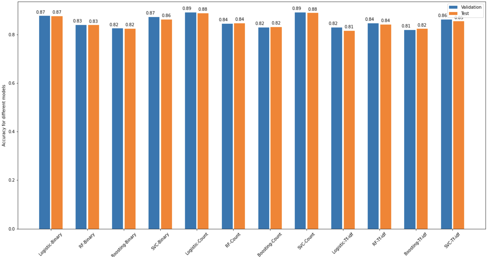
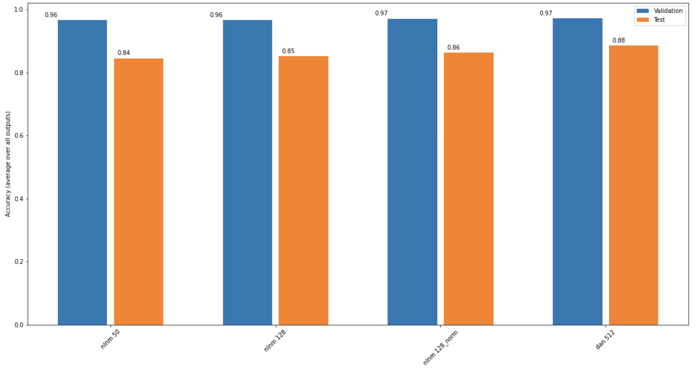
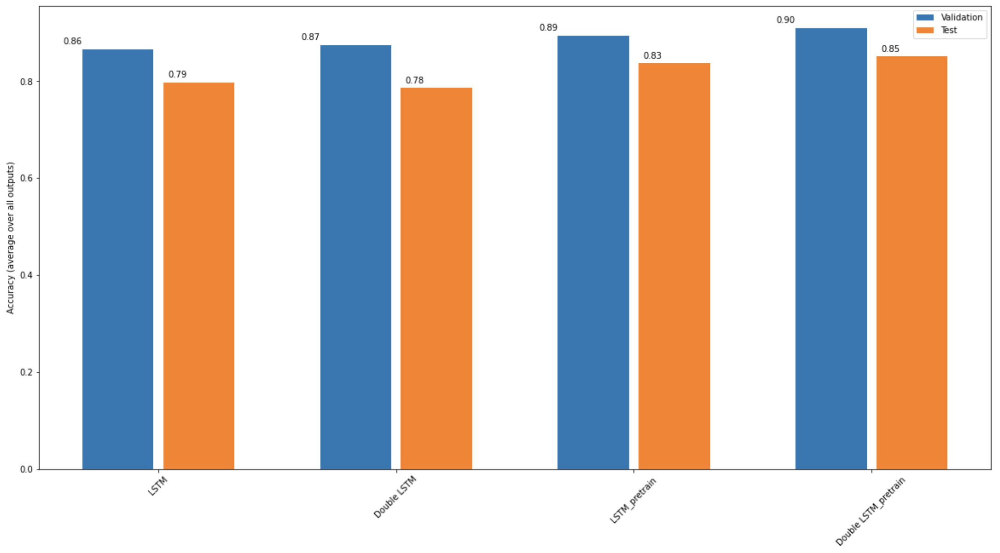

# Machine-Learning-based-classification-for-Sentimental-analysis-of-IMDb-reviews
## Introduction
It is a course project in CS229 Machine Learning at Stanford University in 2020. The project is a Natural Language Processing topic. The languages and relevent packages are **Python - Tensorflow - Keras - Scikit-learn**. The project aims to classify the IMDb reviews as positive and negative reviews. 
## Summary
For this analysis we’ll be using a dataset of 50,000 movie reviews taken from IMDb. The data was compiled by Andrew Maas and can be found here: IMDb Reviews.
The data is split evenly with 25k reviews intended for training and 25k for testing your classifier. Moreover, each set has 12.5k positive and 12.5k negative reviews.
IMDb lets users rate movies on a scale from 1 to 10. To label these reviews the curator of the data labeled anything with ≤ 4 stars as negative and anything with ≥ 7 stars as positive. Reviews with 5 or 6 stars were left out.
## Preprocess
The words are lemmatized and preprocessed into matrix using binary, count, tfidf vectorizer
## Model
The models include logistic regression, random forest, gradient boosting and mlp classifier using Scikit-learns. In addition, the project uses three embedding methods, NNLM 50, NNLM 128, NNLM 128 with normalization and universal encoder and Long Short Term Memory (LSTM) to classify the text.
## Result

<figure>
  
</figure>
<figure>
  
</figure>
<figure>
  
</figure>
The training acc of nnlm embedding model can achieve around 98%. But for the valadation acc, the sklearn models with count vectorizer are better.
